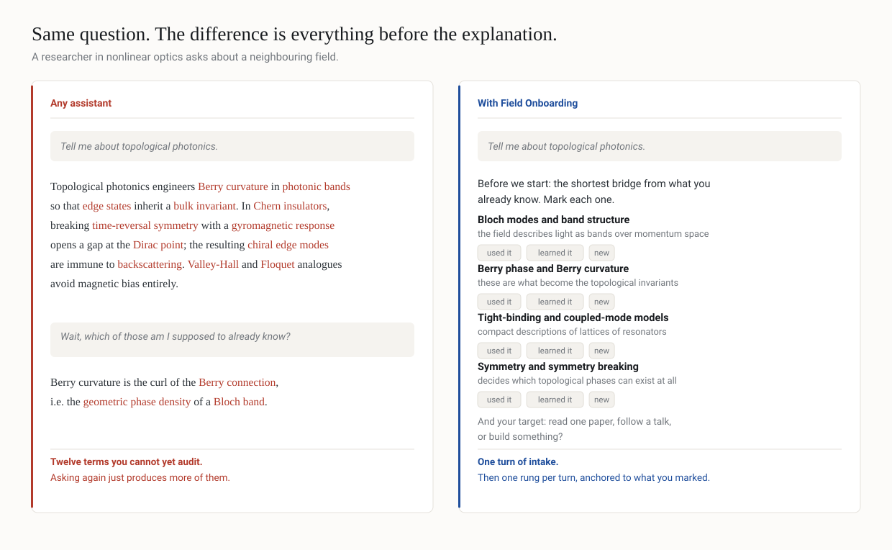

# Field Onboarding

[](LICENSE)
[](#changelog)
[](field-onboarding/SKILL.md)
[](AGENTS.md)
[](AGENTS.md)

<p align="center">
  
</p>

A reusable research-onboarding skill for **ChatGPT, Codex, and other instruction-following agents**. It guides researchers into unfamiliar scientific fields step by step and decodes dense papers, abstracts, talks, figure captions, and referee comments without assuming specialist knowledge too early.

**Primary contributors:** LI Junxiang and Ziyan Zhou (Anna)

## Quick start — try it in under a minute

**ChatGPT:** package the `field-onboarding/` directory as a skill (or install the release artifact if one is published), then try:

```text
I understand nonlinear optics but not topological photonics. Guide me into the field step by step.
```

**Codex or another repository-aware agent:** clone/open this repository so the agent can read `AGENTS.md`, then try:

```text
Use the Field Onboarding workflow to teach me chiral phonons. My background is experimental optics.
```

**No installation / manual adaptation:** give your agent `field-onboarding/SKILL.md` as its instruction file and ask one of the example prompts below.

A good first response should calibrate your prerequisites and learning target instead of immediately dumping a full expert-level explanation.

Conversely, if you ask a narrow factual question, a good response answers it in one turn and does **not** open a prerequisite checklist. See [Scope](#scope-when-it-fires-and-when-it-does-not).

## Scope: when it fires, and when it does not

The skill is a teaching mode, not a default. It is designed to stay out of the way.

**It should run when** you are new to a field, cannot parse a paper or abstract, ask for a step-by-step walkthrough or a reading path, or say an explanation was too technical. It fires even if you only name an unfamiliar field without asking to be taught.

**It should not run when**

- the question is narrow and factual and one turn answers it;
- you are a specialist asking a specific technical question inside your own field;
- you asked for it short (`quickly`, `TL;DR`, `简单说`);
- the task is translation, editing, formatting, debugging, or a search with a known target;
- you are blocked mid-experiment and need the fix;
- you already declined the ladder earlier in the session.

The governing heuristic is the **one-turn test**: if the question can be answered well in a single turn, the agent answers it and then offers the ladder once, in one line. Answer first, offer second.

## Core workflow

The agent follows a progressive research-learning loop:

0. **Check applicability** — apply the one-turn test first; answer directly and offer the ladder once when the ladder is not warranted.
1. **Calibrate** — identify 3–5 load-bearing prerequisites and the user's target.
2. **Why the field exists** — explain the problem and what capability the field adds.
3. **Vocabulary map** — define the small set of terms that unlock the literature.
4. **Core framework** — introduce the central model/equation with a worked example.
5. **Practice** — explain how experiments, calculations, datasets, or analysis are actually done.
6. **Frontier** — identify unresolved questions and a reading path in which every named work is either verified with a checkable identifier or explicitly labelled `from memory, unverified`.
7. **Checkpoint and branch** — test understanding, then advance, re-explain, or skip ahead.

For supplied scientific text, the skill switches to **Decode mode** and separates **source claim**, **background**, **inference**, and **critique**.

## Reference discipline

Reading paths are where language models fabricate. A plausible title with a plausible author list and a plausible year costs the reader an afternoon, so the skill enforces a hard rule at every point where a specific work is named:

- **Verified** — looked up in this session, with DOI, arXiv ID, or journal/volume/page.
- **From memory, unverified** — believed to exist but not checked, and labelled in those words.

Bare citations with no label are not permitted. Identifiers that were not actually retrieved are never attached, because a fabricated DOI is worse than no DOI: it looks checked. Where verification is impossible, the skill gives an executable search pointer (venue, group, query) instead of a citation, and prefers three verified items to seven unverified ones.

## Repository structure

```text
research-field-onboarding/
├── README.md
├── AGENTS.md
├── CONTRIBUTING.md
├── LICENSE
├── .gitignore
├── docs/
│   ├── before-after.svg        # README graphic (English)
│   ├── before-after-zh.svg     # Chinese variant, for posts
│   └── *.png                   # 2x raster fallbacks
├── tools/
│   └── make_demo.py            # regenerates the graphics
└── field-onboarding/
    ├── SKILL.md
    ├── agents/
    │   └── openai.yaml
    └── references/
        └── examples.md
```

## Step-by-step: use with ChatGPT Skills

1. Download or clone this repository.
2. Use the `field-onboarding/` directory as the skill root.
3. Keep `SKILL.md` at that root and preserve `agents/openai.yaml`.
4. Package the skill directory with the Skill packaging tool available in your ChatGPT environment, or upload the validated `skill.zip` release artifact.
5. Start a conversation with a prompt such as: `I understand nonlinear optics but not topological photonics. Guide me into the field step by step.`
6. The skill should first calibrate prerequisites and target rather than dumping a complete specialist explanation.

## Step-by-step: use with Codex

The repository includes a root-level `AGENTS.md`, which tells Codex how to discover and apply the canonical workflow.

1. Clone the repository into a workspace visible to Codex.
2. Open the repository as the working project.
3. Keep `AGENTS.md` at the repository root.
4. Keep the canonical behavior in `field-onboarding/SKILL.md`; `AGENTS.md` directs Codex to read it when the task matches.
5. Ask Codex a research-onboarding task, for example: `Use the Field Onboarding workflow to teach me chiral phonons. My background is experimental optics.`
6. If Codex has web/search capability, it should verify freshness-sensitive claims. If it does not, it should flag that limitation rather than invent current references.

## Step-by-step: adapt to other agents

The skill is deliberately tool-agnostic. For another agent framework:

1. Use `field-onboarding/SKILL.md` as the canonical instruction document.
2. Configure the framework to load it when the user's task matches the frontmatter description.
3. If the framework supports repository instructions, also load or adapt `AGENTS.md`.
4. Map the agent's capabilities to the compatibility rules in `AGENTS.md` (web, files, interactive vs. batch).
5. Keep vendor-specific metadata separate from the canonical workflow.
6. Test the agent with the sample prompts in `field-onboarding/references/examples.md` and compare behavior against the stated good-response patterns.

## Example prompts

- `I am new to exciton-polaritons. Walk me through the field step by step.`
- `I understand nonlinear optics but not topological photonics. Help me get oriented.`
- `I cannot parse this abstract. Explain what it is actually saying.`
- `Give me a reading path into chiral phonons.`
- `一步一步带我入门拓扑光子学。`

And a prompt it should **not** take over:

- `Quick one: what does MRO stand for in this field?` — expect a direct answer plus a one-line offer, not a prerequisite checklist.

## Design principles

- Answer first, offer the ladder second. Never put an intake questionnaire in front of a one-line question.
- One conceptual rung per turn by default.
- Define jargon on first use.
- Anchor new concepts to the user's existing expertise.
- Say where the analogy breaks. An analogy the user over-trusts is worse than no analogy.
- Separate source claims, background knowledge, inference, and critique.
- Never invent a reference. Verified or labelled unverified, with no third option.
- Verify freshness-sensitive information when tools permit.
- Use diagnostic checkpoints instead of generic comprehension questions.
- Degrade gracefully when an agent lacks browsing, file access, or interactivity.

## Changelog

### v1.1.0

- Added a **When not to use this skill** section and the one-turn test, plus a matching `Do not use for ...` clause in the frontmatter description. The skill previously had broad positive triggers and no negative ones, so it over-fired on narrow questions.
- Added a **Naming literature** section making the verified / `from memory, unverified` label mandatory for every named work, and forbidding unretrieved identifiers.
- Restored the imperative register of the instruction text throughout. Normative prose (`guessing the user's level when a short calibration would materially improve the explanation`) was replaced with direct rules (`Skipping Step 0 and guessing at their level`), which agents follow more reliably.
- Added handling for the two most common real-session behaviors: the user ignoring the prerequisite checklist, and the user skipping the checkpoint with "continue".
- Added `references/examples.md` cases for a negative trigger and for a labelled reading path.

### v1.0.0

- Initial public release.

## Contributing

Contributions are welcome. See [CONTRIBUTING.md](CONTRIBUTING.md).

## License

MIT License. Copyright (c) 2026 LI Junxiang and Ziyan Zhou (Anna).
