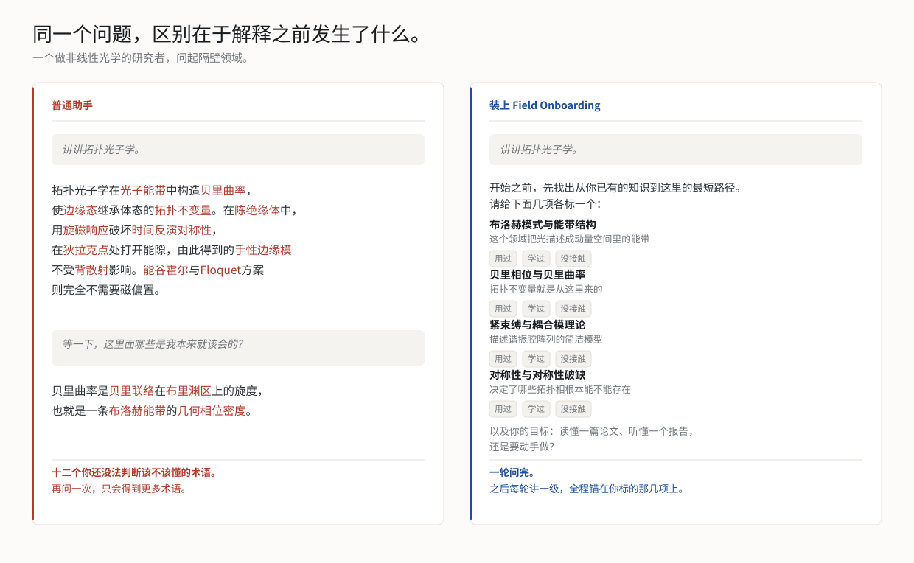

<div align="center">


<p>
<a href="LICENSE"></a>

<a href="https://github.com/ljx-chase/research-field-onboarding/stargazers"></a>

</p>

<strong>语言</strong>: <a href="README.md">English</a> | <a href="README.zh-CN.md">中文</a>

<p><strong>可运行于</strong>: <a href="#快速开始">Claude Code</a> | <a href="#快速开始">Claude 客户端</a> | <a href="#快速开始">ChatGPT Skills</a> | <a href="#快速开始">Codex</a> | <a href="#快速开始">其他遵循指令的 agent</a></p>

</div>

> 一个 skill，让 AI 在解释一个陌生领域之前先问你已经会什么，之后一次只讲一级，并且给出的每一篇文献都标注是否核实过。

<p align="center">
  
</p>

## 快速导航

| 章节 | 能帮你解决什么 |
|---|---|
| [为什么需要它](#为什么需要它) | 它被造出来防止的失败，以及它刻意不做的事。 |
| [更适合谁](#更适合谁) | 你的处境是否落在它的设计范围内。 |
| [快速开始](#快速开始) | 在 Claude Code、Claude 客户端、ChatGPT Skills 或 Codex 上安装。 |
| [怎么触发](#怎么触发) | 中英文里能可靠触发它的几种句式。 |
| [它和别的做法有什么不同](#它和别的做法有什么不同) | 让它区别于一条长 prompt 的四条规则。 |
| [触发范围](#触发范围) | 它什么时候该闪开，以及 one-turn test。 |
| [五级阶梯](#五级阶梯) | 五个级别，以及你的目标如何重塑它们。 |
| [文献纪律](#文献纪律) | 为什么它不会给你一条没查过的引用。 |
| [示例提示词](#示例提示词) | 可直接复制的起手式，含一条它应该拒绝接管的。 |
| [更新记录](#更新记录) | 改了什么，以及每条改动是被哪次真实会话逼出来的。 |
| [引用](#引用) | 在论文、报告或项目文档里引用它。 |
| [相关项目](#相关项目) | 邻近的工具，以及这个的位置。 |

## 为什么需要它

**问一个你不懂的领域，AI 会按懂的人的水平回答你。** 答案是对的。但你用不了，也判断不出那十二个术语里哪些是你本来就该会的。再问一次，只会得到更多术语。

问题不是模型知道得太少，而是没有人在选择起点之前，先问过你知道什么。

这个 skill **不是**知识库，里面没有各领域的综述内容。领域快照写完就开始过期，而且把五个领域做好，等于让其余所有领域悄悄降级。它携带的是一套纪律：

> **先定位读者，再从那个位置往上讲，一次一级。**

模型本来就懂那些物理。它默认缺的，是在开口指路之前先问你站在哪儿的习惯。

## 更适合谁

它是围绕一个具体处境设计的：**你在某处已经是内行，需要在另一处建立方向感。**

- **要读本行以外文献的研究生和博后**。难点不在智力，而在于判断哪些陌生术语是可以跳过的。
- **在评估邻近领域某个方法的研究者**。你需要的是决定它适不适合你的问题，而不是把它学通。
- **被编造的引用坑过的人**。你需要一条每一项都带标注的阅读路径。
- **审稿人、答辩委员、导师**，需要读懂本行之外的稿件。

它刻意在两种情况下作用有限：你是这个领域的内行、在问本行的具体问题；或者你只想要一句话的事实回答。这两种情况下它被设计成闪开。见[触发范围](#触发范围)。

## 快速开始

**Claude Code** — 一条命令：

```bash
npx skills add ljx-chase/research-field-onboarding -g
```

或者把 `field-onboarding/` 复制到 `~/.claude/skills/`。去掉 `-g`、或者改用 `.claude/skills/`，可以只在单个项目里生效。

**Claude 客户端（claude.ai、桌面端、Cowork）** — 桌面端和云端会话不读取 `~/.claude/skills/`。需要在账号层面启用：桌面端侧栏的 Customize，或者 claude.ai 的技能设置。

**ChatGPT Skills** — 以 `field-onboarding/` 作为 skill 根目录，`SKILL.md` 放在根、`agents/openai.yaml` 与它同级，然后用你环境里的打包工具打包。

**Codex 或其他能读仓库的 agent** — 把本仓库克隆进工作区，保持 `AGENTS.md` 在根目录。它会告诉 agent 何时加载这套流程。

**其他情况** — 直接把 `field-onboarding/SKILL.md` 作为指令文件交给 agent。

装好后试试：

```text
我懂非线性光学，但不懂拓扑光子学，一步一步带我入门。
```

正确的第一反应是列出前置概念、问你哪些已经掌握，而不是上来就是一段定义。

## 怎么触发

触发由 `field-onboarding/SKILL.md` 里的 `description` 决定，没有咒语。任何表达「我还不懂这个领域」的说法都应该有效。可靠的几种模式：

- **说出领域名，要求被带一遍。** `一步一步带我入门<领域>`、`我刚接触<领域>，帮我建立方向感`
- **说出你的桥。** `我懂<你已有的>，但不懂<领域>`。这是最有效的一种，等于在它开口问之前就把锚点递过去了。
- **直接贴文本。** 摘要、图注、审稿意见，问它到底在说什么。
- **要一条路径。** `给我一条进入<领域>的阅读路径`
- **说上一个回答不行。** `刚才那段太技术了，往回退一步讲`
- **说明用途。** `我要搭一套<装置>，告诉我需要哪些知识`。目标会改变每一级的形状和篇幅，值得多花一句话说清楚。

英文同理：`Guide me into <field> step by step.`、`I know X but not Y.`

## 它和别的做法有什么不同

**1. 前置概念由它来列。** 不是问「你什么背景」，你看不见的知识缺口自己没法审计。Agent 自己算出这个话题真正依赖的三到五个上游框架，每项配一句话解释，让你把每项标成**用过**、**学过**或**没接触**。然后它真的会用这些标记：标了用过的直接当锚点、绝不重讲；讲不完的明确声明为黑箱；承重的缺口先补上，再往上搭。

**2. 一次只讲一级。** 动机、词汇、核心框架、方法、前沿。每级一轮，结尾出一道真的诊断题——预测、复述、或者二选一——而不是「听懂了吗」，那个问题永远得到「懂了」。答错了换个角度重讲，不是把同一段说得更大声。

**3. 它不会编文献。** 阅读路径是模型最容易凭空捏造的地方，一个标题合理、年份也合理的假文献，够你白找一下午。每一篇被点名的文献要么本轮检索验证过并给出 DOI 或 arXiv 号，要么明确标注 `from memory, unverified`。没有第三种，也绝不附上没有真正检索到的标识符。

**4. 它知道什么时候该闭嘴。** 问一个窄的事实问题，就得到一个窄的回答。阶梯只在结尾用一句话提一次，你不接就不再提。

## 触发范围

**应该触发**：你刚接触一个领域、读不懂某篇论文或摘要、要求一步步讲解或者一条阅读路径、或者说某个解释太技术了。哪怕你只是说出一个陌生领域的名字、并没有明确要求被教，它也会触发。

**不该触发**：问题窄而且是事实性的；你是这个领域的内行、在问一个具体技术细节；你明确要求简短；任务是翻译、编辑、排版、debug，或者目标明确的检索；你正卡在实验中间需要的是解法；你在这次会话里已经拒绝过一次。

判断依据是 **one-turn test**：如果一轮就能把问题答好，就先答，然后用一句话提一次阶梯。先回答，再提议。

## 五级阶梯

| 级别 | 交付什么 |
| --- | --- |
| 0. 标定 | 列出并标记前置概念，确定你的目标 |
| 1. 这个领域为什么存在 | 它被发明出来解决的问题，以及在此之前什么不够用 |
| 2. 词汇地图 | 解锁文献所需的 5–10 个术语，含记号、你本行的对应概念、以及假朋友 |
| 3. 核心框架 | 中心模型，从你已接受的东西推出来而不是直接断言，配一个完整算例和失效区间 |
| 4. 实际怎么做 | 测量或计算流程、原始输出、输出如何变成科学论断、常见假信号 |
| 5. 前沿与入口 | 哪些问题未解，以及一条带标注的阅读路径 |

你的**目标**会路由整条阶梯，而不只是决定篇幅。读懂一篇论文会加重记号和形式体系；判断某方法适不适合你的工作会以现象和算例开路、并展开第 4 级；要动手做则把第 4 级变成流程。结束时它会给出一份你能带走的东西：术语表、阅读路径、该领域尚未解决的问题，以及你还没补上的前置概念。

如果你直接贴进来一段文本，它会切到 **Decode 模式**，把**原文论断**、**背景知识**、**推论**和**评论**分开标注，让你看清哪句是哪句。

## 文献纪律

- **已验证** — 本轮检索确认过，附 DOI、arXiv 号或者期刊卷页。
- **凭记忆，未核实** — 认为它存在但没查，并且原话标注出来。

不允许出现没有标注的裸引用。无法验证时，它给的是可执行的检索指令（会议、课题组、检索式）而不是引用，并且宁可给三条查过的，也不给七条没查过的。

它也会声明自己的约定。当一个领域存在互相竞争的符号、相位、单位或归一化约定时，agent 会说明自己在用哪一套、并指出另一套，因为读者如果没法把这个公式对到论文里的公式上，就等于没有被引导入门。

## 示例提示词

- `我刚开始接触激子极化激元，一步一步带我入门。`
- `我懂非线性光学，但不懂拓扑光子学，帮我建立方向感。`
- `这段摘要我看不懂，它到底在说什么？`
- `给我一条进入手性声子的阅读路径。`
- `I am new to exciton-polaritons. Walk me through the field step by step.`

以及一条它**不该**接管的：

- `简单问一下，这个领域里 MRO 是什么的缩写？` — 期望得到直接回答加一句提议，而不是一张前置概念清单。

## 仓库结构

```
research-field-onboarding/
├── README.md
├── README.zh-CN.md
├── AGENTS.md                   # 给能读仓库的 agent 的入口
├── CONTRIBUTING.md
├── LICENSE
├── .gitignore
├── logo.png
├── docs/
│   ├── before-after.svg        # README 配图（英文）
│   ├── before-after-zh.svg     # README 配图（中文）
│   ├── logo.svg                # banner 的矢量源文件
│   ├── logo-zh.png             # banner，中文
│   └── logo-icon.png           # 方形标志，用作头像和社交预览
├── tools/
│   ├── make_demo.py            # 重新生成 SVG，按需生成 PNG
│   └── make_logo.py            # 重新生成 logo 文件
└── field-onboarding/
    ├── SKILL.md                # 唯一的正典指令文档
    ├── agents/
    │   └── openai.yaml
    └── references/
        └── examples.md         # 正向与负向的行为示例
```

`SKILL.md` 是唯一的事实来源，其余都是包装。

## 设计原则

- 先回答，再提议阶梯。绝不在一句话就能答完的问题前面摆一份问卷。
- 默认一轮只讲一级。
- 术语首次出现就定义，并说明自己在用哪套约定。
- 把新概念锚到用户已有的专长上，然后说清类比在哪里断掉。一个被过度信任的类比，比没有类比更糟。
- 把原文论断、背景知识、推论、评论分开。
- 绝不编造文献。已验证或标注未核实，没有第三种。
- 用诊断性检查点，而不是泛泛的「听懂了吗」。
- 结束时给出用户能带走的东西。
- Agent 缺少联网、文件访问或交互能力时，优雅降级而不是失效。

## 更新记录

### v1.3.0

三条改动都来自一次真实的 SHG 入门会话。

- **检查点必须限定在刚讲过的那一级之内。** 那次会话出的题需要一条该级从未讲过的标度关系，于是答错考的是讲解本身而不是读者。现在要求：你必须能指出答案所在的那句话，并且一个只标了这些前置概念的人应该答得出来。
- **锚点不再被静默外推。** 把「实际用过激光」标成用过，不等于默认你熟悉飞秒脉冲。某一级如果需要锚点内部某个更窄的子技能，必须点名并解释，或者直接问。
- **篇幅由目标决定**，并给出了按目标划分的字数表。要搭装置的人，第 1 级压到 100-200 词，时间花在第 3、4 级；要读论文的人则相反。

### v1.2.0

- **约定声明规则。** Agent 必须说明自己在用哪套符号、相位、单位或归一化约定，并指出竞争的那一套。约定不匹配是从解释切换到论文时最常见的隐性失败。
- **目标现在路由整条阶梯**，而不只是决定哪一级展开。读论文、判断方法适配性、动手做、听报告，四种目标各有不同形状。
- **收尾产物。** 会话结束时给出可带走的内容：术语表、带标注的阅读路径、该领域的开放问题、以及尚未覆盖的前置概念。
- **放宽字数预算**至每级约 200–500 词，第 3 级最多 700 词。旧上限装不下「有推导的框架 + 一个算例 + 失效区间」。

### v1.1.2

- 移除已提交的 PNG 位图。它们是从 SVG 派生的产物，也是仓库里仅有的二进制文件，在磁盘受限的机器上 `git clone` 就是卡在它们身上。需要位图时用 `tools/make_demo.py --png` 重新生成。

### v1.1.1

- Step 0 现在要求在有交互控件的界面里必须使用交互式清单，纯文本表格只作为明确的兜底。之前的措辞（`Use a checklist or multi-select control if the interface offers one`）是个条件从句，实测中被跳过了：前置概念被打印成静态表格，用户只能手打标记。检查点的测验规则做了同样的强化。
- 补了一条对应的 anti-pattern。

### v1.1.0

- 新增 **When not to use this skill** 一节和 one-turn test，并在 frontmatter 描述里加上 `Do not use for ...` 从句。此前只有宽泛的正向触发词、没有负向条件，导致它在窄问题上过度触发。
- 新增 **Naming literature** 一节，强制每一篇被点名的文献二选一标注，并禁止附上没有真正检索到的标识符。
- 全文恢复祈使语气。规范性描述被换成直接的指令，agent 对后者的服从度明显更高。
- 补上两种最常见的真实会话行为：用户无视前置概念清单，以及用户用「继续」跳过检查点。
- 在 `references/examples.md` 中补充了负向触发和带标注阅读路径两个示例。

### v1.0.0

- 首次公开发布。

## 参与贡献

欢迎贡献，尤其欢迎来自物理科学以外学科的行为示例，以及「它不该触发却触发了」的负向案例。详见 [CONTRIBUTING.md](CONTRIBUTING.md)。

## 引用

如果它对你的阅读或教学有帮助，可以这样引用：

```bibtex
@misc{field_onboarding_2026,
  title        = {Field Onboarding: a cross-agent skill for step-by-step onboarding
                  into unfamiliar research fields},
  author       = {Li, Junxiang and Zhou, Ziyan},
  year         = {2026},
  howpublished = {\url{https://github.com/ljx-chase/research-field-onboarding}},
  note         = {GitHub repository}
}
```

## 相关项目

同一空间里的邻近工具，以及这个的位置：

- **[paper-search](https://github.com/ykdojo/paper-search)** — 通过 OpenAlex 检索论文。那是检索，这个是读懂。
- **[Junshi](https://github.com/junshi-research/research-junshi)** — 追踪你的文献并给出排序过的研究点子。它假设你已经读得懂这个领域；这个 skill 管的是在那之前的阶段。
- **[claude-scholar](https://github.com/Galaxy-Dawn/claude-scholar)** — 覆盖选题、实验、写作、rebuttal 的半自动科研工作流。范围大得多；这个 skill 只做一件事，并且被设计成可以直接塞进它们任何一个里。

如果你维护着这个领域的项目而上面的描述有误，开 issue 我来改。

## 致谢

`SKILL.md` 遵循 Anthropic 的 Agent Skills 格式，这是同一个文件能在 Claude Code、ChatGPT Skills 和 Codex 上原样运行的原因。

更新记录里有好几条改动来自真正用过它、并且告诉我它在哪里坏掉的人。那比功能建议值钱得多，也是我最希望收到的贡献。

## 许可

MIT License. Copyright (c) 2026 LI Junxiang and Ziyan Zhou (Anna).
