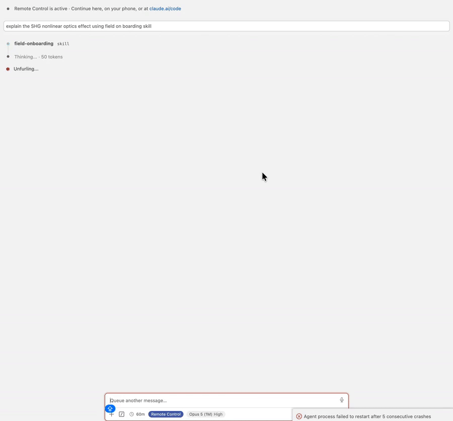

<div align="center">


<p>
<a href="LICENSE"></a>

<a href="https://github.com/ljx-chase/research-field-onboarding/stargazers"></a>

</p>

<strong>语言</strong>: <a href="README.md">English</a> | <a href="README.zh-CN.md">中文</a>

</div>

> **问一个你不懂的领域，AI 会按懂的人的水平回答你。** 这个 skill 让它先问你已经会
> 什么，按你选的讲解风格一次只讲一级，并且绝不说出一篇它没核实过的文献。

🆕 **v1.8 新增** — 它可以先给领域画一张地图再开始讲。在开场的几个问题里选上地图，
就能看到这个领域的结构：取自教科书目录、综述的章节标题或课程大纲，而不是临场现编，
每个部分都标成讲过、检验过或跳过。不选也没关系，课程仍然按这个结构来规划。
[跳到先地图后路径](#先地图后路径)。

觉得有用的话，点个 ⭐ 能让更多人找到它。想知道规则什么时候变了就 Watch 一下：
更新记录基本每周都在动，大多是我自己拿它读东西的时候发现哪里不对，改的。

## 快速开始

如果你的 agent 能访问 GitHub，直接把这句话发给它：

```text
安装 field-onboarding skill：
https://github.com/ljx-chase/research-field-onboarding
按照仓库 AGENTS.md 的 Installation 部分完成安装并验证。
```

Agent 会判断自己的 Skill 目录并完成复制和验证。也可以按下面的平台说明手动安装。

**Claude Code** — 一条命令：

```bash
npx skills add ljx-chase/research-field-onboarding -g
```

或者把 `field-onboarding/` 复制到 `~/.claude/skills/`。去掉 `-g`、或者改用 `.claude/skills/`，可以只在单个项目里生效。

**Claude 客户端（claude.ai、桌面端、Cowork）** — 桌面端和云端会话不读取 `~/.claude/skills/`。需要在账号层面启用：桌面端侧栏的 Customize，或者 claude.ai 的技能设置。

**ChatGPT Skills** — 以 `field-onboarding/` 作为 skill 根目录，`SKILL.md` 放在根、`agents/openai.yaml` 与它同级，然后用你环境里的打包工具打包。

**Codex 或其他能读仓库的 agent** — 把本仓库克隆进工作区，保持 `AGENTS.md` 在根目录。它会告诉 agent 何时加载这套流程。

**其他情况** — 直接把 `field-onboarding/SKILL.md` 作为指令文件交给 agent。

安装到这里就结束了。用户不需要运行状态脚本、编辑 JSON 或选择保存路径；有能力的 agent 会在内部自动使用，没有 Python 或文件权限的 agent 会退回原来的纯 prompt 流程。

装好后试试：

```text
我懂非线性光学，但不懂拓扑光子学，一步一步带我入门。
```

正确的第一反应是列出前置概念、问你哪些已经掌握，而不是上来就是一段定义。

## 为什么需要它

**问一个你不懂的领域，AI 会按懂的人的水平回答你。** 答案是对的。但你用不了，也判断不出那十二个术语里哪些是你本来就该会的。再问一次，只会得到更多术语。

### 不使用它

> **你：** 解释一下 Transformer 里的 attention。
>
> Transformer 用 self-attention 取代 recurrence，把每个 token 投影成 query、key 和 value 向量，通过点积计算分数，用 softmax 归一化，再把多个 attention head 拼接起来，经 residual connection 送入 feed-forward block，同时配合 layer norm 和 positional encoding。
>
> **你：** 这里面哪些是我本来就应该会的？
>
> Self-attention 会把每个 token 映射成三个学习得到的投影，然后对整个序列做按相似度加权的求和。

### 使用它

> **你：** 解释一下 Transformer 里的 attention。
>
> 开始之前，先找出从你现有知识到 attention 最短的桥。请标记下面每一项：
>
> - **矩阵乘法和点积** — attention 本质上是一系列矩阵运算
> - **神经网络的前向传播** — 一层网络如何把输入变成输出
> - **Softmax 和概率归一化** — attention 权重从这里产生
> - **Embedding 和序列表示** — 文本如何变成模型可以处理的向量
>
> `用过` / `学过` / `没接触`
>
> 讲解方式：**1 物理图像优先（默认）/ 2 图像与推导并重 / 3 严格推导优先**。如果没有出现按钮，回复数字即可。
>
> 另外可选：要不要先看一张领域地图？回复「地图」即可，不回复就跳过。

*十二个术语，它只问了其中四个，而不是把十二个一次性全甩给你。然后从你实际所在的位置开始，一次只往上讲一级。*

问题不是模型知道得太少，而是没有人在选择起点之前，先问过你知道什么。

这个 skill **不是**知识库，里面没有各领域的综述内容。领域快照写完就开始过期，而且把五个领域做好，等于让其余所有领域悄悄降级。它携带的是一套纪律：

> **先定位读者，再从那个位置往上讲，一次一级。**

模型本来就懂那些物理。它默认缺的，是在开口指路之前先问你站在哪儿的习惯。

<p align="center">
  
</p>

## 它和别的做法有什么不同

**1. 前置概念由它来列。** 不是问「你什么背景」，你看不见的知识缺口自己没法审计。Agent 自己算出这个话题真正依赖的三到五个上游框架，每项配一句话解释，让你把每项标成**用过**、**学过**或**没接触**。然后它真的会用这些标记：标了用过的直接当锚点、绝不重讲；讲不完的明确声明为黑箱；承重的缺口先补上，再往上搭。

**2. 把讲解风格和技术层级分开。** 可以选择物理图像优先、图像与推导并重、严格推导优先。默认把你当作「有研究能力、但刚进入这个领域的人」：术语会拆开讲，机制、假设和公式都保留。宿主提供结构化选择工具时，Agent 必须真的调用；没有时只需回复一个数字。

**3. 一次只讲一级。** 动机、词汇、核心框架、方法、前沿。每级一轮，结尾出一道真的诊断题——预测、复述、或者二选一——而不是「听懂了吗」，那个问题永远得到「懂了」。答错了换个角度重讲，不是把同一段说得更大声。

**4. 它不会编文献。** 阅读路径是模型最容易凭空捏造的地方，一个标题合理、年份也合理的假文献，够你白找一下午。每一篇被点名的文献要么本轮检索验证过并给出 DOI 或 arXiv 号，要么明确标注 `from memory, unverified`。没有第三种，也绝不附上没有真正检索到的标识符。

**5. 它知道什么时候该闭嘴。** 问一个窄的事实问题，就得到一个窄的回答。阶梯只在结尾用一句话提一次，你不接就不再提。

## 更适合谁

它是围绕一个具体处境设计的：**你在某处已经是内行，需要在另一处建立方向感。**

- **要读本行以外文献的研究生和博后**。难点不在智力，而在于判断哪些陌生术语是可以跳过的。
- **在评估邻近领域某个方法的研究者**。你需要的是决定它适不适合你的问题，而不是把它学通。
- **被编造的引用坑过的人**。你需要一条每一项都带标注的阅读路径。
- **审稿人、答辩委员、导师**，需要读懂本行之外的稿件。

它刻意在两种情况下作用有限：你是这个领域的内行、在问本行的具体问题；或者你只想要一句话的事实回答。这两种情况下它被设计成闪开。见[触发范围](#触发范围)。

## 怎么触发

触发由 `field-onboarding/SKILL.md` 里的 `description` 决定，没有咒语。任何表达「我还不懂这个领域」的说法都应该有效。可靠的几种模式：

- **说出领域名，要求被带一遍。** `一步一步带我入门<领域>`、`我刚接触<领域>，帮我建立方向感`
- **说出你的桥。** `我懂<你已有的>，但不懂<领域>`。这是最有效的一种，等于在它开口问之前就把锚点递过去了。
- **直接贴文本。** 摘要、图注、审稿意见，问它到底在说什么。
- **要一条路径。** `给我一条进入<领域>的阅读路径`
- **说上一个回答不行。** `刚才那段太技术了，往回退一步讲`
- **说明用途。** `我要搭一套<装置>，告诉我需要哪些知识`。目标会改变每一级的形状和篇幅，值得多花一句话说清楚。

英文同理：`Guide me into <field> step by step.`、`I know X but not Y.`

## 快速导航

| 章节 | 能帮你解决什么 |
|---|---|
| [为什么需要它](#为什么需要它) | 它被造出来防止的失败，以及它刻意不做的事。 |
| [更适合谁](#更适合谁) | 你的处境是否落在它的设计范围内。 |
| [快速开始](#快速开始) | 在 Claude Code、Claude 客户端、ChatGPT Skills 或 Codex 上安装。 |
| [怎么触发](#怎么触发) | 中英文里能可靠触发它的几种句式。 |
| [它和别的做法有什么不同](#它和别的做法有什么不同) | 这些规则，以及每一条为什么存在。 |
| [触发范围](#触发范围) | 它什么时候该闪开，以及 one-turn test。 |
| [五级阶梯](#五级阶梯) | 五个级别，以及你的目标如何重塑它们。 |
| [先地图后路径](#先地图后路径) | 结构从哪里来、标记了什么，以及怎么接着上次学。 |
| [文献纪律](#文献纪律) | 为什么它不会给你一条没查过的引用。 |
| [示例提示词](#示例提示词) | 可直接复制的起手式，含一条它应该拒绝接管的。 |
| [更新记录](#更新记录) | 改了什么，以及每条改动是被哪次真实会话逼出来的。 |
| [引用](#引用) | 在论文、报告或项目文档里引用它。 |

## 触发范围

**应该触发**：你刚接触一个领域、读不懂某篇论文或摘要、要求一步步讲解或者一条阅读路径、或者说某个解释太技术了。哪怕你只是说出一个陌生领域的名字、并没有明确要求被教，它也会触发。

**不该触发**：问题窄而且是事实性的；你是这个领域的内行、在问一个具体技术细节；你明确要求简短；任务是翻译、编辑、排版、debug，或者目标明确的检索；你正卡在实验中间需要的是解法；你在这次会话里已经拒绝过一次。

判断依据是 **one-turn test**：如果一轮就能把问题答好，就先答，然后用一句话提一次阶梯。先回答，再提议。

## 五级阶梯

| 级别 | 交付什么 |
| --- | --- |
| 0. 标定 | 列出并标记前置概念，确定你的目标 |
| 1. 这个领域为什么存在 | 它被发明出来解决的问题，以及在此之前什么不够用 |
| 2. 词汇地图 | 解锁文献所需的 5–10 个术语，含记号、你本行的对应概念、以及假朋友 |
| 3. 核心框架 | 中心模型，从你已接受的东西推出来而不是直接断言，配一个完整算例和失效区间 |
| 4. 实际怎么做 | 测量或计算流程、原始输出、输出如何变成科学论断、常见假信号 |
| 5. 前沿与入口 | 哪些问题未解，以及一条带标注的阅读路径 |

你的**目标**会路由整条阶梯，而不只是决定篇幅。读懂一篇论文会加重记号和形式体系；判断某方法适不适合你的工作会以现象和算例开路、并展开第 4 级；要动手做则把第 4 级变成流程。结束时它会给出一份你能带走的东西：标好状态的领域地图、术语表、阅读路径、该领域尚未解决的问题，以及你还没补上的前置概念。

如果你直接贴进来一段文本，它会切到 **Decode 模式**，把**原文论断**、**背景知识**、**推论**和**评论**分开标注，让你看清哪句是哪句。

## 先地图后路径

第 1 级之前，agent 会先取来这个领域现成的结构（标准教科书的目录、近期综述的章节标题或课程大纲），并标注「已验证」或「凭记忆，未核实」，而不是现编一套课程。**地图**是这个领域包含什么，**路径**是这次会话按你的目标实际走的那几个部分，每个部分都标成 `new`、`taught`、`checked` 或 `skipped`。看不看地图是开场问题里的一个选项，不选就不显示；但无论看不看，课程都按它来规划，结束时也都会说出哪些部分没讲、各自是干什么用的。收尾产物里带着这张地图，贴进新会话就能接着学。这一步是手动的：你自己保存、自己贴回去，skill 不会在会话之间替你记住任何东西。

## 文献纪律

- **已验证** — 本轮检索确认过，附 DOI、arXiv 号或者期刊卷页。
- **凭记忆，未核实** — 认为它存在但没查，并且原话标注出来。

不允许出现没有标注的裸引用。无法验证时，它给的是可执行的检索指令（会议、课题组、检索式）而不是引用，并且宁可给三条查过的，也不给七条没查过的。

它也会声明自己的约定。当一个领域存在互相竞争的符号、相位、单位或归一化约定时，agent 会说明自己在用哪一套、并指出另一套，因为读者如果没法把这个公式对到论文里的公式上，就等于没有被引导入门。

## 示例提示词

- `我刚开始接触激子极化激元，一步一步带我入门。`
- `我懂非线性光学，但不懂拓扑光子学，帮我建立方向感。`
- `这段摘要我看不懂，它到底在说什么？`
- `给我一条进入手性声子的阅读路径。`
- `I am new to exciton-polaritons. Walk me through the field step by step.`

以及一条它**不该**接管的：

- `简单问一下，这个领域里 MRO 是什么的缩写？` — 期望得到直接回答加一句提议，而不是一张前置概念清单。

## 仓库结构

```
research-field-onboarding/
├── README.md
├── README.zh-CN.md
├── AGENTS.md                   # 给能读仓库的 agent 的入口
├── CONTRIBUTING.md
├── LICENSE
├── .gitignore
├── logo.png
├── docs/
│   ├── before-after.svg        # README 配图（英文）
│   ├── before-after-zh.svg     # README 配图（中文）
│   ├── logo.svg                # banner 的矢量源文件
│   ├── logo-zh.png             # banner，中文
│   └── logo-icon.png           # 方形标志，用作头像和社交预览
├── tools/
│   ├── make_demo.py            # 重新生成 SVG，按需生成 PNG
│   └── make_logo.py            # 重新生成 logo 文件
└── field-onboarding/
    ├── SKILL.md                # 唯一的正典指令文档
    ├── agents/
    │   └── openai.yaml
    ├── scripts/
    │   └── knowledge_state.py  # 可选、对用户不可见的会话状态工具
    └── references/
        ├── examples.md         # 正向与负向的行为示例
        ├── evals.md            # 回归用例集，改动合并前要跑
        ├── pacing.md           # 按目标划分的篇幅与路由
        ├── field-map.md        # 地图与路径、节点状态、续学
        ├── unsettled-fields.md # grounded 模式，以及何时拒绝
        ├── citations.md        # 已验证 / 未核实规则
        ├── checkpoints.md      # 检查点题型与分支
        ├── decode-mode.md      # 处理贴进来的文本
        ├── state-runtime.md    # 能力检查与内部状态流程
        ├── anti-patterns.md    # 这个 skill 曾经怎么坏掉
        └── search-recipes.md   # 用于验证的开放接口查询模板         # 正向与负向的行为示例
```

`SKILL.md` 是唯一的事实来源，其余都是包装。

## 设计原则

- 先回答，再提议阶梯。绝不在一句话就能答完的问题前面摆一份问卷。
- 默认一轮只讲一级。
- 术语首次出现就定义，并说明自己在用哪套约定。
- 把新概念锚到用户已有的专长上，然后说清类比在哪里断掉。一个被过度信任的类比，比没有类比更糟。
- 把原文论断、背景知识、推论、评论分开。
- 绝不编造文献。已验证或标注未核实，没有第三种。
- 用诊断性检查点，而不是泛泛的「听懂了吗」。
- 结束时给出用户能带走的东西。
- Agent 缺少联网、文件访问或交互能力时，优雅降级而不是失效。

## 更新记录

### v1.8.1

- **地图改为可选，默认不显示。** 不问就把地图印在第一轮讲解的开头，会让那一轮很长，而且不是每个读者都想在第 1 级之前先看完整个领域的布局。现在开场问题里会在讲解风格旁边多给一个选项，不选就没有地图。结构照样会取来、路径照样按它规划，没讲到的部分照样在结束时点名，收尾产物里也照样带着地图供续学。
- **结构型的收尾检验写进了 `SKILL.md`。** 评测 P20 里最后一道检验题问的是概念题，而不是哪个节点依赖哪个。原因是这条规则只写在 `field-map.md` 和 `checkpoints.md` 里，而会话后段不会重新加载它们。现在 `SKILL.md` 直接写明，收尾时也会重新加载 `field-map.md`。
- 为了保持在 3000 词以内，`SKILL.md` 的 Decode 模式一节改为指向 `decode-mode.md` 里的步骤，不再重复列出。
- 新增 P21（地图是提供的选项，而不是强加）和 P22（没选的地图不显示）两条评测用例。

### v1.8.0

- **教之前先给领域画地图。** 阶梯在单次会话里能走出一条不错的弧线，但每一级讲什么是临场规划的：大体合理，每次都不一样，用户也看不出漏掉了什么。每次会话又都从零开始，几次会话下来只剩几段互不相连的碎片。现在第 1 级之前，agent 会先取来领域现成的结构（标准教科书目录，其次是近期综述的章节标题，再次是课程大纲），并标注「已验证」或「凭记忆，未核实」。没有检索能力时会明说，并给出一个具体的核对动作；凭记忆写的大纲绝不冒充某本书的章节编号。
- **地图和路径分开。** 地图是这个领域包含什么；路径是这次会话按目标走的那几个节点。每个节点标成 `new`、`taught`、`checked` 或 `skipped`（附理由）。地图只紧凑地打印一次：路径逐行列出，跳过的节点合成一行名字。
- **没讲的要点名。** 会话结束时列出没讲到的节点、各自是干什么用的；最后一道检验题问的是哪个节点依赖哪个，而不是复述一个已经给过的定义。
- **可以手动续学。** 收尾产物现在以地图和节点状态开头，贴进新会话就会从这些状态接着走，不再重跑前置概念问卷。这是手动的：skill 自己不会在会话之间记住任何东西。
- **状态助手记录地图。** `knowledge_state.py`（schema 0.3.0）新增地图节点、带标注的地图来源、附理由的 `skipped` 状态，以及 `mark` 命令。`mark` 也能记录「讲了但跳过了检验」的一级；这种情况以前一激活下一个概念就会被退回队列。`summary` 给出每个节点的状态，每种状态转换都有测试覆盖。
- **`SKILL.md` 仍控制在 3000 词以内。** 它增加了地图一节和两条规则（现在共十二条）。为腾出篇幅，删去了三段只是在重复对应 reference 文件的内容（Behavioral examples、Verifying and searching、anti-pattern 摘要），以及「When the field is not settled」一节里的 grounded 模式摘要。索引表仍指向所有文件，没有删掉任何一条规则。
- **新增九条评测用例**：五条正例（P16–P20）、四条负例（N10–N13）。负例必须有，因为地图很容易被滥用：它只为入门请求而建，绝不因为问题「看起来很大」就建。

### v1.7.0

- **新增三种讲解风格：**物理图像优先（默认）、图像与推导并重、严格推导优先。名称只表示教学顺序，不模仿某位作者的文风。
- **把清楚和浅薄分开。** 默认面向「有研究能力、但刚进入这个领域的人」：解释领域术语，同时保留公式、假设、尺度和适用边界。
- **强化交互式 intake。** 有可调用的结构化选择工具时必须真正调用；没有时提供只需回复一个数字的兜底选项。
- **在内部状态中保存偏好。** 可选状态助手现在记录讲解风格和技术层级，支持中途切换，并增加对应回归测试。

### v1.6.0

- **新增可选的 agent 内部状态管理。** 具备运行条件的 agent 可以使用零依赖的 `scripts/knowledge_state.py`，在多轮引导中维护学习阶梯，同时不向学习者暴露命令、JSON 或存储细节。
- **保持 Skill 可移植。** 没有 Python 或临时文件权限时自动退回原有的纯 prompt 行为；一次性解释不会启动状态运行时。
- **让进度可以验证。** 状态模型分别记录用户自述、证据和覆盖进度，检查前置依赖与环路，采用原子写入，并支持幂等操作 ID。
- **补齐运行说明和测试。** 新增 `references/state-runtime.md`、正负例评测项和确定性的单元测试。

### v1.5.0

这一版没有新增任何行为。两项改动都是因为指令文件已经长到规则不再被可靠执行。

- **`SKILL.md` 收缩为控制面。** 它已经涨到约 4000 词，而在更短的时候就已经观测到两条规则被跳过。未成熟领域处理、decode 模式、文献标注、篇幅路由、检查点机制、anti-patterns 全部移入 `references/`，用到时才加载。入口降到约 2700 词，没有删掉任何一条规则。
- **新增 `references/evals.md`**：六条负例、十条正例、一对多语言检查，每条都有二元的通过判据。贡献流程现在要求在全新会话里跑相关用例并贴出结果。这套用例包含了实测中发现的那两次失败，它们不会再悄悄回来。

### v1.4.0

- **教之前先判定这个领域 settle 了没有**，并说明属于三种状态里的哪一种：已成熟、新兴或有争议、以及自己也说不清。读者有权知道拿到的是共识还是重构。
- **未成熟领域走 grounded 模式。** 没有教科书的时候，"讲对"这个标准根本不可用：核心论断必须归到具体工作上并沿用既有的验证标注，不稳定的术语要标出竞争叫法，第 5 级从"哪几个组在做、分歧在哪"搭起来，并说明自己的信息截止到什么时候。成熟领域的讲解仍然不加逐句引用——那里每一个引用位都只是一次编造机会。
- **明确的拒绝。** 领域太新、自己没有可靠图景、又没有检索能力时，说清楚做不到并交出检索式，而不是用听起来合理的结构把空白填上。
- **目标物闭环。** 开场说"我想读懂这篇"的人，一开始就会被告知有哪几级挡在中间，结束时会被告知现在能不能读了、还有哪些地方可能卡住。
- 新增 `references/search-recipes.md`：OpenAlex、Crossref、arXiv 的查询模板，用于确认有没有综述、检验自己的图景是否过期、以及核实某篇文献是否存在。全是开放接口，不需要 key，浏览器里就能跑。

### v1.3.0

三条改动都来自一次真实的 SHG 入门会话。

- **检查点必须限定在刚讲过的那一级之内。** 那次会话出的题需要一条该级从未讲过的标度关系，于是答错考的是讲解本身而不是读者。现在要求：你必须能指出答案所在的那句话，并且一个只标了这些前置概念的人应该答得出来。
- **锚点不再被静默外推。** 把「实际用过激光」标成用过，不等于默认你熟悉飞秒脉冲。某一级如果需要锚点内部某个更窄的子技能，必须点名并解释，或者直接问。
- **篇幅由目标决定**，并给出了按目标划分的字数表。要搭装置的人，第 1 级压到 100-200 词，时间花在第 3、4 级；要读论文的人则相反。

### v1.2.0

- **约定声明规则。** Agent 必须说明自己在用哪套符号、相位、单位或归一化约定，并指出竞争的那一套。约定不匹配是从解释切换到论文时最常见的隐性失败。
- **目标现在路由整条阶梯**，而不只是决定哪一级展开。读论文、判断方法适配性、动手做、听报告，四种目标各有不同形状。
- **收尾产物。** 会话结束时给出可带走的内容：术语表、带标注的阅读路径、该领域的开放问题、以及尚未覆盖的前置概念。
- **放宽字数预算**至每级约 200–500 词，第 3 级最多 700 词。旧上限装不下「有推导的框架 + 一个算例 + 失效区间」。

### v1.1.2

- 移除已提交的 PNG 位图。它们是从 SVG 派生的产物，也是仓库里仅有的二进制文件，在磁盘受限的机器上 `git clone` 就是卡在它们身上。需要位图时用 `tools/make_demo.py --png` 重新生成。

### v1.1.1

- Step 0 现在要求在有交互控件的界面里必须使用交互式清单，纯文本表格只作为明确的兜底。之前的措辞（`Use a checklist or multi-select control if the interface offers one`）是个条件从句，实测中被跳过了：前置概念被打印成静态表格，用户只能手打标记。检查点的测验规则做了同样的强化。
- 补了一条对应的 anti-pattern。

### v1.1.0

- 新增 **When not to use this skill** 一节和 one-turn test，并在 frontmatter 描述里加上 `Do not use for ...` 从句。此前只有宽泛的正向触发词、没有负向条件，导致它在窄问题上过度触发。
- 新增 **Naming literature** 一节，强制每一篇被点名的文献二选一标注，并禁止附上没有真正检索到的标识符。
- 全文恢复祈使语气。规范性描述被换成直接的指令，agent 对后者的服从度明显更高。
- 补上两种最常见的真实会话行为：用户无视前置概念清单，以及用户用「继续」跳过检查点。
- 在 `references/examples.md` 中补充了负向触发和带标注阅读路径两个示例。

### v1.0.0

- 首次公开发布。

## 参与贡献

欢迎贡献，尤其欢迎来自物理科学以外学科的行为示例，以及「它不该触发却触发了」的负向案例。详见 [CONTRIBUTING.md](CONTRIBUTING.md)。

## 反馈

用下来觉得哪里不对，欢迎
[开一个 issue](https://github.com/ljx-chase/research-field-onboarding/issues)。
更新记录里的大部分改动，来自我自己拿它读东西时撞上的问题。这个样本很窄：一个人，
基本只有物理和机器学习。如果它在我根本不会去的地方坏掉，那正是我最想知道的，也比
一个 star 对我有用得多。前置概念在你的领域里列错了、检查点的题从那一级根本答不出来、给的文献
查无此文，这些都值得说一声。eval 用例集就是为了让修一个问题不会悄悄弄坏另一个。

觉得有用的话，点个 star 能让更多人看到。想知道规则什么时候变了，Watch 这个仓库会
收到通知，star 不会。

## 引用

如果它对你的阅读或教学有帮助，可以这样引用：

```bibtex
@misc{field_onboarding_2026,
  title        = {Field Onboarding: a cross-agent skill for step-by-step onboarding
                  into unfamiliar research fields},
  author       = {Li, Junxiang and Zhou, Ziyan},
  year         = {2026},
  howpublished = {\url{https://github.com/ljx-chase/research-field-onboarding}},
  note         = {GitHub repository}
}
```

## 致谢

`SKILL.md` 遵循 Anthropic 的 Agent Skills 格式，这是同一个文件能在 Claude Code、ChatGPT Skills 和 Codex 上原样运行的原因。

更新记录里有好几条改动来自真正用过它、并且告诉我它在哪里坏掉的人。那比功能建议值钱得多，也是我最希望收到的贡献。

## 许可

MIT License. Copyright (c) 2026 LI Junxiang and Ziyan Zhou (Anna).
